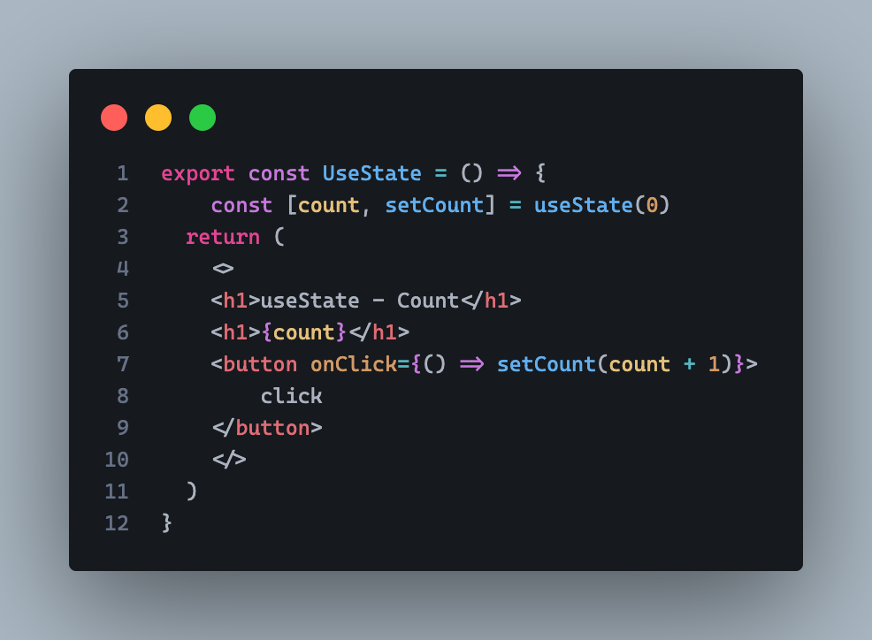

# HOOKS

# UseState
useState es un hook de React que te permite crear y manejar el estado en un componente funcional.

Antes, solo los componentes de clase podían tener estado, pero ahora, con los hooks como useState, puedes hacerlo en componentes de función.

# ---------------------------------------------------------

count: Es la variable de estado.

setCount: Es la función que se usa para cambiar el estado.

useState(0): Se inicializa el estado con el valor 0.

Cada vez que llamas a setContador, el componente se vuelve a renderizar con el nuevo valor.

# ---------------------------------------------------------